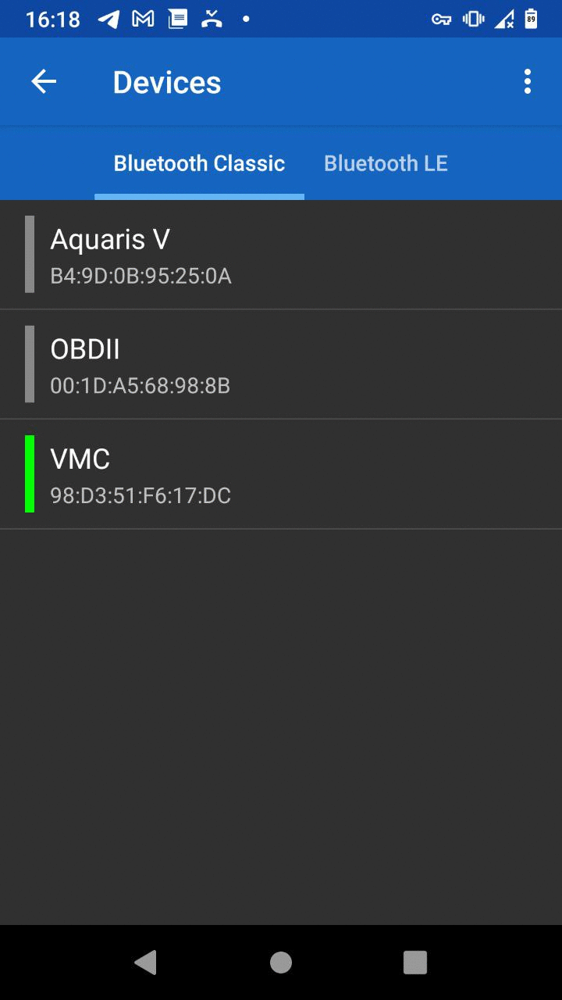

# low-tech_vmc
[](https://www.gnu.org/licenses/agpl-3.0.en.html)
[](https://www.arduino.cc/)
[](https://isocpp.org/)

low-tech_vmc est un projet de construction de VMC double flux de façon low-tech.  
Ce repo présente essentiellement la partie électronique du projet, à base d'Arduino.

Pour avoir tout le détail, notamment la fabrication des caissons, voir cette page :  
https://wiki.lowtechlab.org/wiki/VMC_double_flux

Ce projet a commencé en Janvier 2023.  
C++ est utilisé pour l'ensemble du code source.  
C'est un projet finalisé sujet à des améliorations.


## Mise en garde
Attention à vous lors de la manipulation de la carte et des composants, notamment des ventilateurs et du relais !   
Cette installation est branchée sur le courant alternatif (220V) donc danger de mort si vous ne savez pas ce que vous faites !

Vous pouvez faire les tests sans brancher les ventilateurs. Les led du relais s'allumeront ou s'étendront en fonction du mode de fonctionnement (on/off) ce qui est suffisant pour un simple test.

## Compatibilité
Le code source a été testé avec succès avec les éléments suivants :
- un basic starter kit Arduino Uno R3 (contient la breadboard et les résistances nécessaires)
- une breadboard
- des résistances (1K, 3x 2K et 2x 10K)
- un module Bluetooth HC05
- trois sondes de températures DHT22
- un module relais double (circuit 12V pour les ventilateurs)
- deux ventilateurs Arctic P12 Max PWM
- une alimentation 12V 2A (pour les ventilateurs)
- une alimentation 9V 0.5A (pour la carte Arduino et les différents modules et les sondes)
- l'application Android Serial Bluetooth Terminal (pour télécommander)

Compilation : Arduino IDE sur Linux


## Mise en route
**Télécharger le projet sur votre ordinateur.**
```
git clone https://github.com/alevoski/low-tech_vmc.git
```

## Comment ça marche ?
Téléchargez Arduino IDE sur votre système puis : 

**Configurer le module BT**

Branchez votre carte et le module BT comme ceci :

(ou voir le fichier Fritzing /Schema/config_BT2.fzz)

Puis ouvrez le ficher /CS/config_BT2/config_BT2.ino dans Arduino IDE.  
Branchez votre carte en USB sur votre ordinateur et compiler (Sketch -> Verify/Compile)

Détail complet ici :  
[lien](https://wiki.lowtechlab.org/wiki/VMC_double_flux#%C3%89tape_8_-_Gestion_%C3%A9lectronique_-_configuration_du_module_BT)


**Mise en place final**

Branchez votre carte avec les différents éléments comme ceci :

(ou voir le fichier Fritzing /Schema/vmc_prefinal.fzz)

Puis ouvrez le fichier /CS/CS/vmc_final_v3/CS/vmc_final_v3.ino dans Arduino IDE.  
Branchez votre carte en USB sur votre ordinateur et compiler (Sketch -> Verify/Compile)

Détail complet ici :  
[lien](https://wiki.lowtechlab.org/wiki/VMC_double_flux#%C3%89tape_9_-_Gestion_%C3%A9lectronique_-_mise_en_place)

**Test**  

La carte Arduino doit être alimenter soit via USB soit via un adaptateur secteur.  
Vous n'êtes pas obligé de brancher les ventilateurs ici pour faire le test.

Etapes :
- Télécharger l'application Serial Bluetooth Terminal
- Liez votre smartphone au module HC-05
- Ouvrez l'application
- Sélectionner le device correspondant à votre module HC-05
- Connectez-vous à lui
- Tapez 'h' pour avoir la liste des fonctionnalités
- A vous de les tester une à une
- Vous pouvez configurer des boutons dans cette application pour vos usages récurrents



Détail complet ici :  
[lien](https://wiki.lowtechlab.org/wiki/VMC_double_flux#%C3%89tape_11_-_Gestion_%C3%A9lectronique_-_test_et_pilotage_bluetooth)

## Auteur
Alexandre Buissé

## License
low-tech_vmc. VMC double flux low-tech.  
Copyright (C) 2024 Alexandre Buissé alevoski@pm.me

This program is free software: you can redistribute it and/or modify  
it under the terms of the GNU Affero General Public License as published  
by the Free Software Foundation, either version 3 of the License, or  
(at your option) any later version.  

This program is distributed in the hope that it will be useful,  
but WITHOUT ANY WARRANTY; without even the implied warranty of  
MERCHANTABILITY or FITNESS FOR A PARTICULAR PURPOSE.  See the  
GNU Affero General Public License for more details.  

You should have received a copy of the GNU Affero General Public License  
along with this program.  If not, see <https://www.gnu.org/licenses/>.